# 🧠 QEMU for Embedded Linux

This project demonstrates how to build and emulate a complete embedded Linux system using **QEMU**, covering every stage — from bootloader to root filesystem — with optional Yocto-based image support. It’s fully scriptable, hardware-free, and ideal for learning and prototyping.

---

## 🚀 Getting Started

### 🔧 Prerequisites

- `qemu-system-arm` and/or `qemu-system-aarch64`
- Git, Python 3, Bash
- Optional: `losetup`, `kpartx`, `mkfs.fat`, `mkfs.ext4`

### 📥 Clone the Repo

```bash
git clone https://github.com/Mo-Alsehli/Qemu-For-Embedded-Linux.git
cd Qemu-For-Embedded-Linux
```

### ▶️ Run QEMU with your own image

You can boot QEMU using the tools and images in:

```bash
cd vexpress_tools
qemu-system-arm -M vexpress-a9 -m 512M \
  -kernel boot/zImage \
  -dtb boot/vexpress-v2p-ca9.dtb \
  -drive file=../sdcard/file.img,if=sd,format=raw \
  -append "root=/dev/mmcblk0p2 rw console=ttyAMA0,115200" \
  -nographic
```

---

## 📁 Project Structure

| Directory                                | Description                                                                                                  |
| ---------------------------------------- | ------------------------------------------------------------------------------------------------------------ |
| [01_introduction](./01_introduction)     | Introductory C++ demo and notes on running simple ARM apps on QEMU.                                          |
| [02_u-boot](./02_u-boot)                 | U-Boot source and documentation for building a bootloader targeting QEMU. Includes `u-boot.bin` output.      |
| [03_virt_sdcard](./03_virt_sdcard)       | Guide for building and partitioning a virtual SD card for QEMU.                                              |
| [04_kernel_devices](./04_kernel_devices) | Notes and examples on Linux kernel devices and how they appear in QEMU.                                      |
| [05_profile](./05_profile)               | Customizing shell environments using `/etc/profile`, `PS1`, etc.                                             |
| [06_yocto_qemu](./06_yocto_qemu)         | Scripts and guides for running both Yocto and Raspbian images in QEMU. Includes full automation and testing. |
| [rpi3b-tools](./rpi3b-tools)             | Boot + rootfs folders for Raspberry Pi 3B. Used to emulate or test RPi images.                               |
| [sdcard](./sdcard)                       | `file.img` (raw disk image) and its internal `boot/` and `rootfs/` — loaded by QEMU.                         |
| [vexpress_tools](./vexpress_tools)       | Ready-to-boot `zImage`, `dtb`, and rootfs for QEMU’s vexpress-a9 board.                                      |
| [yocto](./yocto)                         | Prebuilt `.wic` images from Yocto builds and mountable `yocto_mount` folder for testing.                     |

---

## 🖼️ Boot Flow Overview

```mermaid
graph TD
    A[QEMU vexpress / raspi3b] --> B[U-Boot]
    B --> C[Linux Kernel zImage]
    C --> D[Device Tree .dtb]
    D --> E[Root Filesystem /dev/mmcblk0p2]
    E --> F[BusyBox Init → Login Shell]
```



This flow represents what happens when you run a full system using QEMU:
QEMU starts → U-Boot loads → Kernel + DTB run → Rootfs mounts → BusyBox shell appears.

---

## 📚 References

* 🔗 [Moatasem Elsayed (GitHub)](https://github.com/Moatasem-Elsayed)
* 🎥 [Moatasem Elsayed (YouTube)](https://www.youtube.com/@moatasemelsayed6226)
* 📘 [Yocto Project QEMU Docs](https://docs.yoctoproject.org/dev/dev-manual/qemu.html)
* 🧾 [Official QEMU Documentation](https://www.qemu.org/documentation/)

---

> Feel free to fork, test, and contribute. This project is designed for learning and experimenting — no hardware required.

